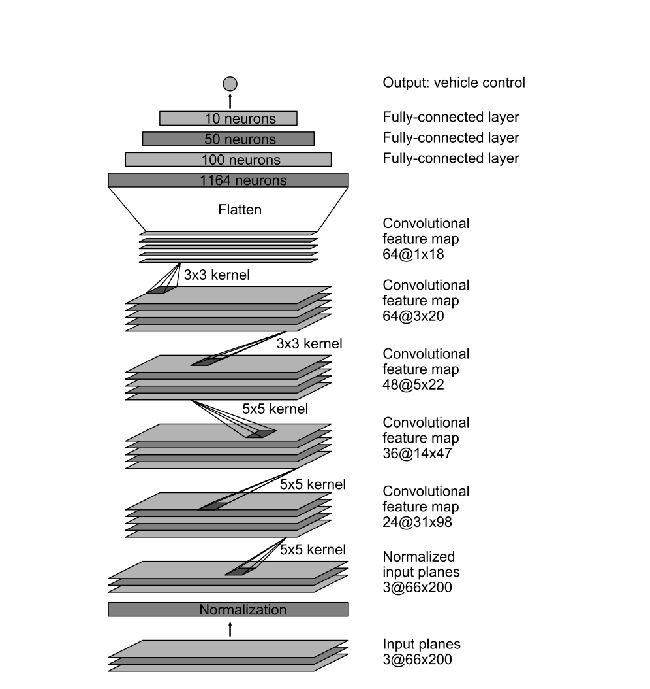

# **Behavioral Cloning Project** 

The goals / steps of this project are the following:
* Use a simulator to collect data of good driving behavior
* Build a convolution neural network in Keras that predicts steering angles from images
* Train and validate the model with a training and validation set
* Test that the model successfully drives around track one without leaving the road


[//]: # (Image References)

[image1]: ./examples/placeholder.png "Model Visualization"
[image2]: ./center_image.jpg "Center Image"
[image3]: ./recovering_image1.jpg "Recovery Image"
[image4]: ./recovering_image2.jpg "Recovery Image"

## Rubric Points
### Here I will consider the [rubric points](https://review.udacity.com/#!/rubrics/432/view) individually and describe how I addressed each point in my implementation.  

---
### Files Submitted & Code Quality

#### 1. Submission includes all required files and can be used to run the simulator in autonomous mode

My project includes the following files:
* model.py containing the script to create and train the model
* drive.py for driving the car in autonomous mode
* model.h5 containing a trained convolution neural network 
* report.pdf summarizing the results

#### 2. Submission includes functional code
Using the Udacity provided simulator and my drive.py file, the car can be driven autonomously around the track by executing 
```sh
python drive.py model.h5
```

#### 3. Submission code is usable and readable

The `Behavioral Cloning.ipynb` notebook contains the code for training and saving the convolution neural network. The file shows the pipeline I used for training and validating the model, and it contains comments to explain how the code works.

### Model Architecture and Training Strategy

#### 1. Nvidia End-To-End model

My model mimicked that developed and tested by Nvidia and it consists of a somewhat deep convolution neural network with the following layers:
	- Normalization Layer
	- Convolutional layer 5x5x24, (2,2) strides (output 38, 78, 24)
	- RELU
	- Convolutional layer 5x5x36, (2,2) strides  (output 17, 37, 36)
	- RELU
	- Convolutional layer 5x5x48, (2,2) strides  (output 7, 17, 48)
	- RELU
	- Convolutional layer 64x3x3, strides  (output 5, 15, 64)
	- RELU
	- Convolutional layer 64x3x3, strides  (output 3, 13, 64)
	- RELU
	- Fully connected layer (100 nodes)
	- Fully connected layer (50 nodes)
	- Fully connected layer (1 node)

The RELU layers are included to introduce nonlinearity, and the data is normalized in the model using a Keras lambda layer. 

#### 2. Attempts to reduce overfitting in the model
All of the convolutional layers contain a regularization step of 0.005 to avoid overfitting.

The model was trained and validated on different data sets to ensure that the model was not overfitting. The model was tested by running it through the simulator and ensuring that the vehicle could stay on the track.

#### 3. Model parameter tuning

The model used an adam optimizer, so the learning rate was not tuned manually.

#### 4. Appropriate training data

Training data was chosen to keep the vehicle driving on the road. The following techniques were used to collect data:
	- Driving in the middle of the road for full laps
	- Starting at the edge of the road, driving towards the center of the road to simulate recovery
	- Starting at the center of the road, but pointing the sidewalk, steer back towards the center of the road to simulate recovering from oversteering.

For details about how I created the training data, see the next section. 

### Model Architecture and Training Strategy

#### 1. Solution Design Approach

The overall strategy for deriving a model architecture was to train a network that can detect line curvature on the road and output the steering angle that corresponds to that turning radius.

My first step was to use a convolution neural network model similar to the one used in Nvidia' End-To-End model. I thought this model might be appropriate because the end-to-end model was successfully trained on a similar dataset (images taken from the center of the car console) and provided a satisfactory degree of robustness.

In order to gauge how well the model was working, I split my image and steering angle data into a training and validation set. For most of my trials, the validation and training loss went hand in hand, perhaps due to my use of regularization. Furthermore, I did not use a large number of epochs, so that might have been a contributor to the absence of overfitting.

The final step was to run the simulator to see how well the car was driving around track one. There were a few spots where the vehicle fell off the track, specifically around corners that did not have a clear marking (e.g. no red-white or yellow marking roadside marking). After about a week of investigation, I realized that I had forgotten to include RELU activation on my neural network. After this simple fix, the car performed exceptionally well. At the end of the process, the vehicle is able to drive autonomously around the track without leaving the road.

Some of the incremental improvements that I made to enhance this model was the following:
	- Use images that are slightly offset to the right and left of the center of the console, then correct the steering by a negative and positive correction factor (+/- 0.1). This helped simulate the car recovering from not being in the center of the lane.
	- Flip the images left to right to augment the training dataset as to avoid teaching the car only to steer to the left. This is mainly because the track is circular and turning left largely outweighs turning right in the training dataset.
	- Resize the image to half the size, as it helped with the training time. This step was done _outside_ of the neural network, such that the input space to the neural network was halved.

#### 2. Final Model Architecture


The final model architecture consisted of a convolution neural network with the following layers and layer sizes:
- Normalization Layer
- Convolutional layer 5x5x24, (2,2) strides (output 38, 78, 24)
- RELU
- Convolutional layer 5x5x36, (2,2) strides  (output 17, 37, 36)
- RELU
- Convolutional layer 5x5x48, (2,2) strides  (output 7, 17, 48)
- RELU
- Convolutional layer 64x3x3, strides  (output 5, 15, 64)
- RELU
- Convolutional layer 64x3x3, strides  (output 3, 13, 64)
- RELU
- Fully connected layer (100 nodes)
- Fully connected layer (50 nodes)
- Fully connected layer (1 node)

Here is a visualization of the architecture followed (though there are adjustments as listed above). This picture was taken directly from [Nvidia's publication](https://arxiv.org/abs/1604.07316).



#### 3. Creation of the Training Set & Training Process

To capture good driving behavior, I first recorded four laps on track one using center lane driving. Here is an example image of center lane driving:

![alt text][image2]

I then recorded the vehicle recovering from the left side and right sides of the road back to center so that the vehicle would learn to recover if it made a mistake in the previous iteration. This images shows a simple example of the car going towards the side, and the steering angle is towards recovering to the center.

![alt text][image3]
![alt text][image4]

After the collection process, and with the flipping of the images, I had ~50,000 data points. I then preprocessed this data by resizing each image to half the size (160 x 80).

I finally randomly shuffled the data set and put 20% of the data into a validation set. 

I used this training data for training the model. The validation set helped determine if the model was over or under fitting. The ideal number of epochs was 10 as evidenced by the plateau of the validation loss after about 12 epochs. I used an adam optimizer so that manually training the learning rate wasn't necessary.
